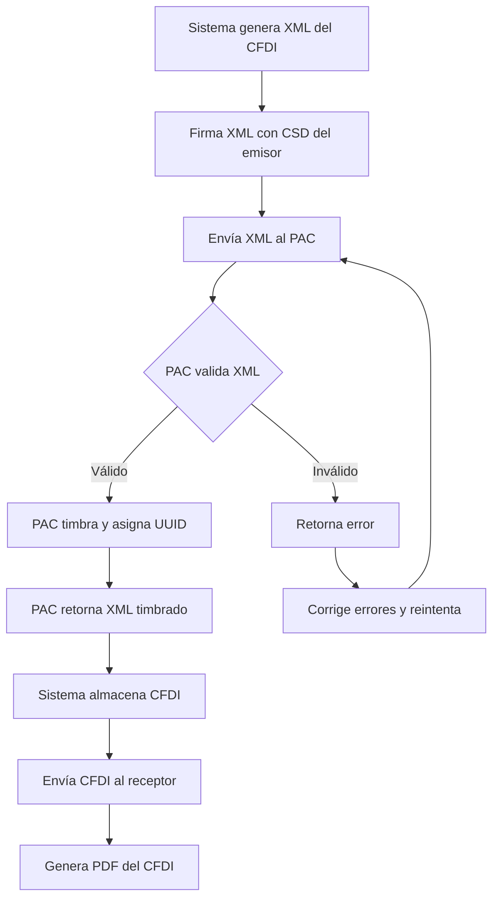
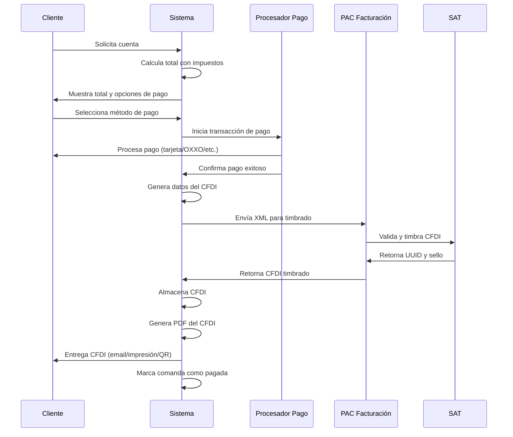
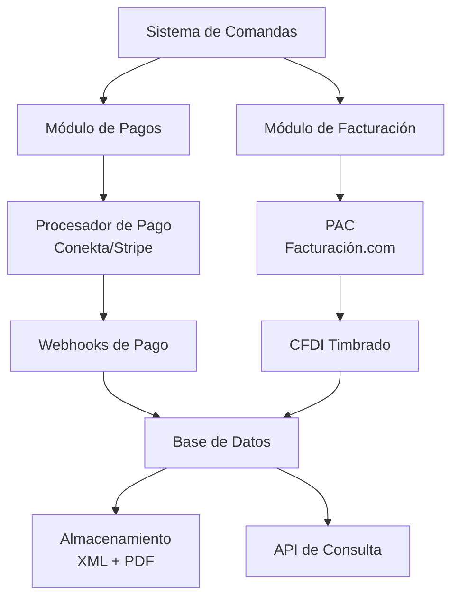

# 💰 Guía de Facturación y Pagos: Sistema de Comandas México

## 📑 Índice

1. [Introducción](#1-introducción)
2. [Facturación Electrónica en México (CFDI)](#2-facturación-electrónica-en-méxico-cfdi)
3. [Integración con PAC (Proveedor Autorizado de Certificación)](#3-integración-con-pac-proveedor-autorizado-de-certificación)
4. [Opciones Fiscales y Legislación Mexicana](#4-opciones-fiscales-y-legislación-mexicana)
5. [Procesadores de Pago en México](#5-procesadores-de-pago-en-méxico)
6. [Comparación de Procesadores de Pago](#6-comparación-de-procesadores-de-pago)
7. [Integración de Pagos con Facturación](#7-integración-de-pagos-con-facturación)
8. [Implementación Técnica](#8-implementación-técnica)
9. [Cumplimiento y Mejores Prácticas](#9-cumplimiento-y-mejores-prácticas)
10. [Comparación con Soft Restaurant](#10-comparación-con-soft-restaurant)

---

## 1. Introducción

Este documento establece los requisitos y mejores prácticas para implementar un sistema de facturación electrónica y procesamiento de pagos en el sistema de comandas, cumpliendo con la legislación fiscal mexicana vigente y alcanzando el nivel de funcionalidad de software profesional como Soft Restaurant.

### 1.1 Objetivos

- **Cumplimiento Fiscal**: Garantizar el cumplimiento total con las regulaciones del SAT
- **Facturación Electrónica**: Emisión automática de CFDI 4.0 válidos
- **Procesamiento de Pagos**: Integración con procesadores de pago mexicanos
- **Nivel Profesional**: Funcionalidades comparables a Soft Restaurant
- **Automatización**: Minimizar intervención manual en procesos fiscales

### 1.2 Alcance

Este documento cubre:
- Requisitos legales para facturación electrónica en México
- Integración con PAC para timbrado de facturas
- Opciones fiscales y complementos del CFDI
- Evaluación y selección de procesadores de pago
- Implementación técnica de facturación y pagos
- Mejores prácticas y cumplimiento

---

## 2. Facturación Electrónica en México (CFDI)

### 2.1 Marco Legal

**Base Legal**:
- Resolución Miscelánea Fiscal (RMF) vigente
- CFDI 4.0 obligatorio desde julio de 2023
- Obligatorio para todos los contribuyentes desde 2014

**Autoridad Reguladora**:
- Servicio de Administración Tributaria (SAT)
- Portal del SAT: www.sat.gob.mx

### 2.2 CFDI 4.0 - Requisitos Obligatorios

#### 2.2.1 Datos del Emisor

**Información Requerida**:
- **RFC**: Registro Federal de Contribuyentes (13 caracteres para personas físicas, 12 para morales)
- **Nombre o Razón Social**: Nombre completo del contribuyente
- **Régimen Fiscal**: Código del régimen según catálogo del SAT
- **Domicilio Fiscal**: Código postal, calle, número exterior e interior, colonia, municipio, estado, país
- **Certificado de Sello Digital (CSD)**: Certificado vigente emitido por el SAT

**Ejemplo de Estructura**:
```xml
<cfdi:Emisor 
  Rfc="ABC123456789" 
  Nombre="RESTAURANTE EJEMPLO S.A. DE C.V." 
  RegimenFiscal="601"
/>
```

#### 2.2.2 Datos del Receptor

**Información Requerida**:
- **RFC**: RFC del cliente (obligatorio si es persona física con actividad empresarial)
- **Nombre o Razón Social**: Nombre del cliente
- **Uso del CFDI**: Clave del catálogo del SAT que indica el uso que dará al comprobante
- **Domicilio Fiscal**: Si el receptor requiere factura, debe proporcionar su domicilio

**Uso del CFDI Común para Restaurantes**:
- **G03 - Gastos en general**: Para clientes que deducen el gasto
- **P01 - Por definir**: Para clientes que aún no definen el uso
- **S01 - Sin efectos fiscales**: Para clientes que no requieren deducción

#### 2.2.3 Conceptos (Productos/Servicios)

**Información Requerida por Concepto**:
- **Clave de Producto o Servicio (C_ClaveProdServ)**: Clave del catálogo del SAT
- **No. de Identificación**: Código interno del producto
- **Cantidad**: Cantidad del producto/servicio
- **Clave de Unidad (C_ClaveUnidad)**: Unidad de medida (H87 - Pieza, MTR - Metro, etc.)
- **Unidad**: Descripción de la unidad
- **Descripción**: Descripción detallada del producto/servicio
- **Valor Unitario**: Precio unitario sin impuestos
- **Importe**: Cantidad × Valor Unitario (sin impuestos)
- **Descuento**: Si aplica descuento

**Claves Comunes para Restaurantes**:
- **50171600**: Servicios de restaurantes y bares
- **50201703**: Alimentos preparados
- **50201704**: Bebidas alcohólicas
- **50201705**: Bebidas no alcohólicas

**Ejemplo de Concepto**:
```xml
<cfdi:Concepto 
  ClaveProdServ="50201703" 
  NoIdentificacion="TACOS-001" 
  Cantidad="2" 
  ClaveUnidad="H87" 
  Unidad="Pieza" 
  Descripcion="Tacos al Pastor" 
  ValorUnitario="80.00" 
  Importe="160.00"
>
  <cfdi:Impuestos>
    <cfdi:Traslados>
      <cfdi:Traslado 
        Base="160.00" 
        Impuesto="002" 
        TipoFactor="Tasa" 
        TasaOCuota="0.160000" 
        Importe="25.60"
      />
    </cfdi:Traslados>
  </cfdi:Impuestos>
</cfdi:Concepto>
```

#### 2.2.4 Impuestos

**IVA (Impuesto al Valor Agregado)**:
- **Tasa General**: 16% (0.16)
- **Tasa Fronteriza**: 8% en zona fronteriza
- **Tasa Cero**: Para algunos productos alimenticios básicos
- **Exento**: Algunos servicios médicos y educativos

**Desglose de Impuestos**:
```xml
<cfdi:Impuestos 
  TotalImpuestosTrasladados="25.60"
>
  <cfdi:Traslados>
    <cfdi:Traslado 
      Base="160.00" 
      Impuesto="002" 
      TipoFactor="Tasa" 
      TasaOCuota="0.160000" 
      Importe="25.60"
    />
  </cfdi:Traslados>
</cfdi:Impuestos>
```

#### 2.2.5 Información de Pago

**Forma de Pago**:
- **03 - Transferencia electrónica de fondos**
- **04 - Tarjeta de crédito**
- **28 - Tarjeta de débito**
- **01 - Efectivo**
- **02 - Cheque nominativo**
- **99 - Por definir**

**Método de Pago**:
- **PUE - Pago en una exhibición**: Pago completo al momento
- **PPD - Pago en parcialidades o diferido**: Pago a plazos

**Ejemplo**:
```xml
<cfdi:Complemento>
  <pago10:Pagos>
    <pago10:Pago 
      FechaPago="2024-01-15T14:30:00" 
      FormaDePagoP="04" 
      MonedaP="MXN" 
      Monto="185.60"
    >
      <pago10:DoctoRelacionado 
        IdDocumento="UUID-de-factura" 
        Serie="A" 
        Folio="123" 
        MonedaDR="MXN" 
        MetodoDePagoDR="PUE" 
        NumParcialidad="1" 
        ImpSaldoAnt="185.60" 
        ImpPagado="185.60" 
        ImpSaldoInsoluto="0.00"
      />
    </pago10:Pago>
  </pago10:Pagos>
</cfdi:Complemento>
```

#### 2.2.6 Información Adicional

**Campos Obligatorios**:
- **Fecha de Emisión**: Fecha y hora exacta de emisión (formato ISO 8601)
- **Folio Fiscal (UUID)**: Identificador único asignado por el PAC
- **Sello Digital del CFDI**: Firma electrónica del comprobante
- **Sello del SAT**: Sello que valida el timbrado
- **Certificado del SAT**: Certificado que valida el sello del SAT
- **Cadena Original del Complemento**: Para validación

### 2.3 Proceso de Emisión de CFDI



**Pasos del Proceso**:

1. **Generación del XML**: El sistema genera el XML con todos los datos requeridos
2. **Firma Digital**: Se firma el XML con el Certificado de Sello Digital (CSD)
3. **Envío al PAC**: Se envía el XML firmado al Proveedor Autorizado de Certificación
4. **Validación y Timbrado**: El PAC valida el XML y lo timbra (asigna UUID)
5. **Almacenamiento**: Se almacena el XML timbrado y se genera el PDF
6. **Entrega al Cliente**: Se entrega el CFDI al cliente (email, impresión, QR)

### 2.4 Almacenamiento y Conservación

**Requisitos Legales**:
- **Período de Conservación**: Mínimo 5 años
- **Formato**: XML original timbrado + PDF
- **Respaldo**: Múltiples copias en diferentes ubicaciones
- **Integridad**: Verificación periódica de integridad de archivos

**Recomendaciones**:
- Almacenamiento en la nube con redundancia
- Respaldo local adicional
- Sistema de versionado
- Auditoría de acceso

---

## 3. Integración con PAC (Proveedor Autorizado de Certificación)

### 3.1 ¿Qué es un PAC?

Un **Proveedor Autorizado de Certificación (PAC)** es una empresa autorizada por el SAT para:
- Validar la estructura del CFDI
- Asignar el Folio Fiscal (UUID)
- Timbrar el comprobante
- Generar el sello del SAT

### 3.2 PACs Principales en México

#### 3.2.1 Facturación.com (Facturación Móvil)

**Características**:
- ✅ API REST moderna y documentada
- ✅ Soporte para CFDI 4.0
- ✅ Precios competitivos
- ✅ SDK disponible para múltiples lenguajes
- ✅ Dashboard web para gestión

**Precios Aproximados**:
- Factura individual: ~$2-3 MXN por factura
- Planes mensuales desde $299 MXN/mes

**Ventajas**:
- Fácil integración
- Buena documentación
- Soporte técnico en español
- Actualizaciones automáticas

#### 3.2.2 Facturama

**Características**:
- ✅ API REST
- ✅ Soporte CFDI 4.0
- ✅ Integración con múltiples sistemas
- ✅ Generación automática de PDF

**Precios Aproximados**:
- Desde $1.50 MXN por factura
- Planes desde $199 MXN/mes

#### 3.2.3 SW Facturación

**Características**:
- ✅ API SOAP y REST
- ✅ Soporte completo CFDI 4.0
- ✅ Integración con sistemas ERP
- ✅ Facturación masiva

**Precios Aproximados**:
- Desde $2 MXN por factura
- Planes empresariales disponibles

#### 3.2.4 Facturación Móvil (Facturación.com)

**Características**:
- ✅ Enfoque en facturación móvil
- ✅ API REST
- ✅ App móvil disponible
- ✅ Facturación rápida

### 3.3 Recomendación: Facturación.com

**Razones**:
1. **API Moderna**: REST API bien documentada
2. **Documentación Completa**: Ejemplos y guías claras
3. **Soporte Técnico**: Respuesta rápida y en español
4. **Precios Competitivos**: Accesible para restaurantes pequeños/medianos
5. **Actualizaciones**: Se mantiene actualizado con cambios del SAT
6. **SDK Disponible**: Facilita la integración

### 3.4 Integración Técnica con PAC

**Flujo de Integración**:

```typescript
// Ejemplo de integración con Facturación.com
interface CFDIRequest {
  emisor: {
    rfc: string
    nombre: string
    regimenFiscal: string
    domicilioFiscal: {
      codigoPostal: string
      calle: string
      numeroExterior: string
      colonia: string
      municipio: string
      estado: string
      pais: string
    }
  }
  receptor: {
    rfc?: string
    nombre: string
    usoCFDI: string
    domicilioFiscal?: {
      codigoPostal: string
      calle: string
      numeroExterior: string
      colonia: string
      municipio: string
      estado: string
      pais: string
    }
  }
  conceptos: Array<{
    claveProdServ: string
    noIdentificacion: string
    cantidad: number
    claveUnidad: string
    unidad: string
    descripcion: string
    valorUnitario: number
    importe: number
    impuestos: {
      traslados: Array<{
        base: number
        impuesto: string
        tipoFactor: string
        tasaOCuota: number
        importe: number
      }>
    }
  }>
  formaPago: string
  metodoPago: string
  moneda: string
  tipoCambio?: number
}

async function timbrarCFDI(cfdiData: CFDIRequest): Promise<CFDIResponse> {
  const response = await fetch('https://api.facturacion.com/v1/cfdi', {
    method: 'POST',
    headers: {
      'Authorization': `Bearer ${API_KEY}`,
      'Content-Type': 'application/json'
    },
    body: JSON.stringify(cfdiData)
  })
  
  if (!response.ok) {
    throw new Error(`Error al timbrar: ${response.statusText}`)
  }
  
  return await response.json()
}
```

---

## 4. Opciones Fiscales y Legislación Mexicana

### 4.1 Regímenes Fiscales Comunes para Restaurantes

#### 4.1.1 Régimen General de Ley (601)

**Características**:
- Personas morales (empresas)
- Obligado a llevar contabilidad
- IVA del 16%
- ISR según tarifa de personas morales
- Facturación obligatoria

**Requisitos**:
- Contabilidad electrónica
- Declaraciones mensuales
- Facturación electrónica obligatoria

#### 4.1.2 Régimen de Incorporación Fiscal (RIF) - 621

**Características**:
- Personas físicas con actividad empresarial
- Ingresos menores a $2 millones anuales
- Beneficios fiscales progresivos
- Facturación simplificada posible

**Requisitos**:
- Facturación electrónica
- Declaraciones mensuales simplificadas

#### 4.1.3 Actividades Empresariales y Profesionales (612)

**Características**:
- Personas físicas
- Ingresos por actividades empresariales
- Facturación obligatoria

### 4.2 Complementos Fiscales

#### 4.2.1 Complemento de Pago

**Uso**: Cuando el pago se realiza en parcialidades o después de la emisión de la factura.

**Ejemplo de Caso**:
- Cliente consume $1,000 MXN
- Se emite factura por $1,000 MXN
- Cliente paga $500 MXN ahora, $500 MXN después
- Se emite complemento de pago por cada abono

**Implementación**:
```xml
<cfdi:Complemento>
  <pago10:Pagos Version="1.0">
    <pago10:Pago 
      FechaPago="2024-01-15T14:30:00" 
      FormaDePagoP="04" 
      MonedaP="MXN" 
      Monto="500.00"
    >
      <pago10:DoctoRelacionado 
        IdDocumento="UUID-factura-original" 
        ImpSaldoAnt="1000.00" 
        ImpPagado="500.00" 
        ImpSaldoInsoluto="500.00"
      />
    </pago10:Pago>
  </pago10:Pagos>
</cfdi:Complemento>
```

#### 4.2.2 Notas de Crédito

**Uso**: Para cancelar, corregir o ajustar una factura ya emitida.

**Casos Comunes**:
- Devolución de productos
- Descuentos posteriores
- Corrección de errores
- Cancelación de factura

**Proceso**:
1. Se genera nota de crédito referenciando el UUID de la factura original
2. Se timbra la nota de crédito
3. Se cancela o ajusta el monto de la factura original

### 4.3 Catálogos del SAT

#### 4.3.1 Catálogo de Productos y Servicios (C_ClaveProdServ)

**Claves Comunes para Restaurantes**:
- **50171600**: Servicios de restaurantes y bares
- **50201703**: Alimentos preparados
- **50201704**: Bebidas alcohólicas
- **50201705**: Bebidas no alcohólicas
- **50201706**: Postres y dulces

**Implementación**:
- Mantener catálogo actualizado en base de datos
- Asociar cada producto del menú con su clave SAT
- Validar claves antes de emitir factura

#### 4.3.2 Catálogo de Unidades de Medida (C_ClaveUnidad)

**Unidades Comunes**:
- **H87 - Pieza**: Para platos individuales
- **MTR - Metro**: Para productos medidos por metro
- **KGM - Kilogramo**: Para productos por peso
- **LTR - Litro**: Para bebidas

#### 4.3.3 Catálogo de Formas de Pago

**Formas Comunes**:
- **01 - Efectivo**
- **02 - Cheque nominativo**
- **03 - Transferencia electrónica de fondos**
- **04 - Tarjeta de crédito**
- **28 - Tarjeta de débito**
- **99 - Por definir**

### 4.4 Sanciones y Multas

**Sanciones por Incumplimiento**:

| Infracción | Multa Mínima | Multa Máxima |
|------------|--------------|--------------|
| No emitir CFDI | $19,700 MXN | $112,650 MXN |
| CFDI con datos incorrectos | $400 MXN | $600 MXN por factura |
| No conservar CFDI | $19,700 MXN | $112,650 MXN |
| Emitir CFDI sin timbrar | $19,700 MXN | $112,650 MXN |

**Prevención**:
- Validación automática antes de emitir
- Almacenamiento automático y seguro
- Auditoría periódica de facturas emitidas
- Mantenimiento de certificados vigentes

---

## 5. Procesadores de Pago en México

### 5.1 Opciones Disponibles

#### 5.1.1 Stripe

**Características**:
- ✅ Procesador internacional con presencia en México
- ✅ Soporte para tarjetas, Apple Pay, Google Pay
- ✅ API moderna y bien documentada
- ✅ Dashboard completo
- ✅ Webhooks para notificaciones

**Comisiones**:
- **Tarjetas nacionales**: 3.6% + $3 MXN por transacción
- **Tarjetas internacionales**: 3.9% + $3 MXN
- **Apple Pay / Google Pay**: Mismas comisiones que tarjetas

**Ventajas**:
- Integración sencilla
- Excelente documentación
- Soporte en múltiples idiomas
- Funcionalidades avanzadas (suscripciones, etc.)

**Desventajas**:
- Comisiones más altas que opciones locales
- Puede requerir cuenta bancaria en el extranjero
- Tiempo de liquidación: 7-14 días

**Recomendación**: ⭐⭐⭐⭐ (4/5)
- Buena opción si necesitas funcionalidades avanzadas
- Considerar si el volumen justifica las comisiones

#### 5.1.2 Conekta

**Características**:
- ✅ Procesador mexicano
- ✅ Especializado en el mercado mexicano
- ✅ Soporte para tarjetas, OXXO Pay, SPEI, efectivo
- ✅ API REST moderna
- ✅ Excelente documentación en español

**Comisiones**:
- **Tarjetas de crédito**: 3.49% + $2.50 MXN
- **Tarjetas de débito**: 2.49% + $2.50 MXN
- **OXXO Pay**: $10 MXN por transacción
- **SPEI**: $5 MXN por transacción

**Ventajas**:
- Comisiones competitivas
- Opciones de pago locales (OXXO, SPEI)
- Tiempo de liquidación: 1-3 días hábiles
- Soporte en español
- Enfoque en mercado mexicano

**Desventajas**:
- Menos conocido internacionalmente
- Menos funcionalidades avanzadas que Stripe

**Recomendación**: ⭐⭐⭐⭐⭐ (5/5)
- **MEJOR OPCIÓN para restaurantes en México**
- Comisiones competitivas
- Opciones de pago locales importantes
- Tiempo de liquidación rápido

#### 5.1.3 OpenPay

**Características**:
- ✅ Procesador mexicano (del grupo BBVA)
- ✅ Soporte para tarjetas, OXXO Pay, SPEI
- ✅ API REST
- ✅ Integración con terminales físicas

**Comisiones**:
- **Tarjetas de crédito**: 3.49% + $2.50 MXN
- **Tarjetas de débito**: 2.49% + $2.50 MXN
- **OXXO Pay**: $10 MXN
- **SPEI**: $5 MXN

**Ventajas**:
- Respaldado por BBVA
- Comisiones competitivas
- Opciones de pago locales
- Terminales físicas disponibles

**Desventajas**:
- Documentación menos completa que Conekta
- Menos flexibilidad en integración

**Recomendación**: ⭐⭐⭐⭐ (4/5)
- Buena opción, similar a Conekta
- Considerar si ya se tiene relación con BBVA

#### 5.1.4 Mercado Pago

**Características**:
- ✅ Procesador de Mercado Libre
- ✅ Muy conocido en México
- ✅ Soporte para tarjetas, efectivo, transferencias
- ✅ Checkout integrado

**Comisiones**:
- **Tarjetas**: 3.99% + $3 MXN
- **Efectivo (OXXO)**: $10 MXN

**Ventajas**:
- Reconocimiento de marca
- Checkout fácil de usar
- Opciones de pago variadas

**Desventajas**:
- Comisiones más altas
- Menos control sobre la experiencia de pago
- Más orientado a e-commerce que a restaurantes

**Recomendación**: ⭐⭐⭐ (3/5)
- Considerar solo si el reconocimiento de marca es importante
- Comisiones más altas que competidores

### 5.2 Comparación Rápida

| Procesador | Comisión Tarjeta | OXXO Pay | SPEI | Liquidación | Recomendación |
|------------|------------------|----------|------|-------------|---------------|
| **Conekta** | 3.49% + $2.50 | ✅ $10 | ✅ $5 | 1-3 días | ⭐⭐⭐⭐⭐ |
| **OpenPay** | 3.49% + $2.50 | ✅ $10 | ✅ $5 | 1-3 días | ⭐⭐⭐⭐ |
| **Stripe** | 3.6% + $3 | ❌ | ❌ | 7-14 días | ⭐⭐⭐⭐ |
| **Mercado Pago** | 3.99% + $3 | ✅ $10 | ❌ | 3-5 días | ⭐⭐⭐ |

### 5.3 Recomendación Final: Conekta

**Razones para elegir Conekta**:

1. **Comisiones Competitivas**: Mejor relación precio/valor
2. **Opciones de Pago Locales**: OXXO Pay y SPEI son importantes en México
3. **Tiempo de Liquidación Rápido**: 1-3 días vs 7-14 de Stripe
4. **Soporte en Español**: Documentación y soporte en español nativo
5. **Enfoque en México**: Diseñado específicamente para el mercado mexicano
6. **API Moderna**: REST API bien documentada
7. **Apple Pay / Google Pay**: Soporte disponible

**Cuándo considerar Stripe**:
- Si necesitas funcionalidades muy avanzadas (suscripciones complejas, marketplace, etc.)
- Si planeas expandir a otros países
- Si el reconocimiento internacional es importante

---

## 6. Comparación de Procesadores de Pago

### 6.1 Análisis Detallado

#### 6.1.1 Integración Técnica

**Conekta**:
```typescript
// Ejemplo de integración con Conekta
import Conekta from 'conekta'

const conekta = new Conekta(process.env.CONEKTA_PRIVATE_KEY)

// Crear orden de pago
const order = await conekta.orders.create({
  currency: 'MXN',
  customer_info: {
    name: 'Juan Pérez',
    email: 'juan@example.com',
    phone: '+5215551234567'
  },
  line_items: [{
    name: 'Tacos al Pastor',
    unit_price: 8000, // en centavos
    quantity: 2
  }],
  charges: [{
    payment_method: {
      type: 'card',
      token_id: 'tok_test_visa_4242'
    }
  }]
})
```

**Stripe**:
```typescript
// Ejemplo de integración con Stripe
import Stripe from 'stripe'

const stripe = new Stripe(process.env.STRIPE_SECRET_KEY)

// Crear pago
const paymentIntent = await stripe.paymentIntents.create({
  amount: 16000, // en centavos
  currency: 'mxn',
  payment_method_types: ['card'],
  metadata: {
    order_id: '12345'
  }
})
```

#### 6.1.2 Métodos de Pago Soportados

| Método | Conekta | OpenPay | Stripe | Mercado Pago |
|--------|---------|---------|--------|--------------|
| Tarjeta de Crédito | ✅ | ✅ | ✅ | ✅ |
| Tarjeta de Débito | ✅ | ✅ | ✅ | ✅ |
| Apple Pay | ✅ | ❌ | ✅ | ❌ |
| Google Pay | ✅ | ❌ | ✅ | ❌ |
| OXXO Pay | ✅ | ✅ | ❌ | ✅ |
| SPEI | ✅ | ✅ | ❌ | ❌ |
| Efectivo (OXXO) | ✅ | ✅ | ❌ | ✅ |

#### 6.1.3 Experiencia de Usuario

**Conekta**:
- Checkout personalizable
- Formularios de pago optimizados para México
- Validación de tarjetas mexicanas
- Soporte para pagos recurrentes

**Stripe**:
- Checkout muy pulido
- Elementos de pago personalizables
- Mejor experiencia internacional
- Menos optimizado para métodos locales mexicanos

### 6.2 Casos de Uso Específicos

#### 6.2.1 Restaurante Físico (Pago en Mesa)

**Recomendación**: **Conekta** o **OpenPay**
- Terminales físicas disponibles
- Integración con lectores de tarjeta
- Procesamiento rápido
- Opciones de pago locales (OXXO para propinas, etc.)

#### 6.2.2 Restaurante con Delivery

**Recomendación**: **Conekta**
- OXXO Pay para clientes sin tarjeta
- SPEI para pagos grandes
- Apple Pay / Google Pay para pagos rápidos
- Comisiones competitivas

#### 6.2.3 Restaurante con Suscripciones/Membresías

**Recomendación**: **Stripe** o **Conekta**
- Ambos soportan pagos recurrentes
- Stripe tiene más opciones avanzadas
- Conekta es más económico

---

## 7. Integración de Pagos con Facturación

### 7.1 Flujo Completo: Pago + Facturación



### 7.2 Implementación Técnica

**Estructura de Datos**:

```typescript
interface PagoYFacturacion {
  // Datos de la comanda
  comandaId: string
  total: number
  subtotal: number
  iva: number
  propina?: number
  descuento?: number
  
  // Datos del cliente
  cliente: {
    nombre: string
    rfc?: string
    email?: string
    telefono?: string
    usoCFDI?: string
    domicilioFiscal?: DomicilioFiscal
  }
  
  // Método de pago
  metodoPago: {
    tipo: 'tarjeta' | 'efectivo' | 'oxxo' | 'spei' | 'apple_pay' | 'google_pay'
    referencia?: string // Para OXXO, SPEI, etc.
    ultimos4?: string // Para tarjetas
  }
  
  // Resultado del pago
  pago: {
    id: string // ID del procesador
    estado: 'completado' | 'pendiente' | 'fallido'
    monto: number
    comision: number
    fecha: Date
  }
  
  // Facturación
  factura?: {
    uuid: string
    folio: string
    serie: string
    fechaEmision: Date
    xml: string
    pdf: string
    qr: string
  }
}
```

**Función de Procesamiento**:

```typescript
async function procesarPagoYFacturar(
  comandaId: string,
  metodoPago: MetodoPago,
  datosCliente: DatosCliente
): Promise<PagoYFacturacion> {
  
  // 1. Obtener comanda
  const comanda = await obtenerComanda(comandaId)
  
  // 2. Calcular totales
  const totales = calcularTotales(comanda)
  
  // 3. Procesar pago
  const resultadoPago = await procesarPago({
    monto: totales.total,
    metodo: metodoPago,
    descripcion: `Comanda ${comanda.numeroComanda}`
  })
  
  if (resultadoPago.estado !== 'completado') {
    throw new Error('Pago no completado')
  }
  
  // 4. Generar CFDI
  const cfdiData = generarDatosCFDI({
    comanda,
    cliente: datosCliente,
    pago: resultadoPago,
    totales
  })
  
  // 5. Timbrar CFDI
  const cfdiTimbrado = await timbrarCFDI(cfdiData)
  
  // 6. Generar PDF
  const pdf = await generarPDFCFDI(cfdiTimbrado)
  
  // 7. Almacenar
  await almacenarCFDI({
    comandaId,
    pagoId: resultadoPago.id,
    uuid: cfdiTimbrado.uuid,
    xml: cfdiTimbrado.xml,
    pdf
  })
  
  // 8. Enviar al cliente
  if (datosCliente.email) {
    await enviarCFDIporEmail(datosCliente.email, pdf, cfdiTimbrado)
  }
  
  // 9. Actualizar comanda
  await actualizarComanda(comandaId, {
    estado: 'PAGADO',
    pagoId: resultadoPago.id,
    facturaUUID: cfdiTimbrado.uuid
  })
  
  return {
    comandaId,
    pago: resultadoPago,
    factura: {
      uuid: cfdiTimbrado.uuid,
      folio: cfdiTimbrado.folio,
      serie: cfdiTimbrado.serie,
      fechaEmision: new Date(),
      xml: cfdiTimbrado.xml,
      pdf,
      qr: generarQR(cfdiTimbrado)
    }
  }
}
```

### 7.3 Casos Especiales

#### 7.3.1 Pago en Efectivo

**Flujo**:
1. Cliente paga en efectivo
2. Sistema registra pago como "efectivo"
3. Se genera CFDI con forma de pago "01 - Efectivo"
4. Se entrega CFDI al cliente

#### 7.3.2 Pago con OXXO Pay

**Flujo**:
1. Cliente selecciona OXXO Pay
2. Sistema genera referencia de pago
3. Cliente paga en OXXO
4. Sistema recibe notificación de pago (webhook)
5. Se genera CFDI con complemento de pago
6. Se entrega CFDI al cliente

#### 7.3.3 Pago en Parcialidades

**Flujo**:
1. Cliente paga parcialmente
2. Se genera CFDI inicial (sin pago completo)
3. Cliente paga segunda parcialidad
4. Se genera complemento de pago
5. Se actualiza CFDI original

---

## 8. Implementación Técnica

### 8.1 Arquitectura del Sistema



### 8.2 Estructura de Base de Datos

```sql
-- Tabla de Pagos
CREATE TABLE pagos (
  id UUID PRIMARY KEY,
  comanda_id UUID REFERENCES comandas(id),
  monto DECIMAL(10,2) NOT NULL,
  metodo_pago VARCHAR(50) NOT NULL,
  procesador VARCHAR(50) NOT NULL, -- 'conekta', 'stripe', etc.
  procesador_id VARCHAR(255), -- ID del procesador
  estado VARCHAR(20) NOT NULL, -- 'pendiente', 'completado', 'fallido'
  comision DECIMAL(10,2),
  referencia VARCHAR(255), -- Para OXXO, SPEI, etc.
  created_at TIMESTAMP DEFAULT NOW(),
  updated_at TIMESTAMP DEFAULT NOW()
);

-- Tabla de Facturas
CREATE TABLE facturas (
  id UUID PRIMARY KEY,
  comanda_id UUID REFERENCES comandas(id),
  pago_id UUID REFERENCES pagos(id),
  uuid VARCHAR(36) UNIQUE NOT NULL, -- UUID del CFDI
  folio VARCHAR(20),
  serie VARCHAR(10),
  fecha_emision TIMESTAMP NOT NULL,
  emisor_rfc VARCHAR(13) NOT NULL,
  receptor_rfc VARCHAR(13),
  receptor_nombre VARCHAR(255) NOT NULL,
  uso_cfdi VARCHAR(3) NOT NULL,
  subtotal DECIMAL(10,2) NOT NULL,
  iva DECIMAL(10,2) NOT NULL,
  total DECIMAL(10,2) NOT NULL,
  forma_pago VARCHAR(2) NOT NULL,
  metodo_pago VARCHAR(3) NOT NULL,
  xml TEXT NOT NULL, -- XML timbrado
  pdf BYTEA, -- PDF generado
  qr_code TEXT, -- Código QR
  estado VARCHAR(20) DEFAULT 'activa', -- 'activa', 'cancelada'
  created_at TIMESTAMP DEFAULT NOW()
);

-- Tabla de Conceptos de Factura
CREATE TABLE factura_conceptos (
  id UUID PRIMARY KEY,
  factura_id UUID REFERENCES facturas(id),
  producto_id UUID REFERENCES productos(id),
  clave_prod_serv VARCHAR(20) NOT NULL,
  cantidad DECIMAL(10,2) NOT NULL,
  clave_unidad VARCHAR(10) NOT NULL,
  descripcion TEXT NOT NULL,
  valor_unitario DECIMAL(10,2) NOT NULL,
  importe DECIMAL(10,2) NOT NULL,
  iva DECIMAL(10,2) NOT NULL
);

-- Índices
CREATE INDEX idx_facturas_uuid ON facturas(uuid);
CREATE INDEX idx_facturas_comanda ON facturas(comanda_id);
CREATE INDEX idx_facturas_fecha ON facturas(fecha_emision);
CREATE INDEX idx_pagos_comanda ON pagos(comanda_id);
```

### 8.3 Servicios y Módulos

#### 8.3.1 Servicio de Pagos

```typescript
// services/payment.service.ts
export class PaymentService {
  private conekta: Conekta
  
  constructor() {
    this.conekta = new Conekta(process.env.CONEKTA_PRIVATE_KEY)
  }
  
  async procesarPago(data: PaymentData): Promise<PaymentResult> {
    // Implementación con Conekta
  }
  
  async procesarPagoOXXO(monto: number): Promise<OXXOPayment> {
    // Generar referencia OXXO
  }
  
  async procesarPagoSPEI(monto: number): Promise<SPEIPayment> {
    // Generar referencia SPEI
  }
  
  async verificarWebhook(signature: string, payload: string): Promise<boolean> {
    // Verificar webhook de Conekta
  }
}
```

#### 8.3.2 Servicio de Facturación

```typescript
// services/invoice.service.ts
export class InvoiceService {
  private pac: PACClient
  
  constructor() {
    this.pac = new PACClient(process.env.PAC_API_KEY)
  }
  
  async generarCFDI(data: CFDIData): Promise<CFDIResult> {
    // Generar XML
    const xml = this.generarXML(data)
    
    // Timbrar con PAC
    const timbrado = await this.pac.timbrar(xml)
    
    // Generar PDF
    const pdf = await this.generarPDF(timbrado)
    
    // Almacenar
    await this.almacenarCFDI(timbrado, pdf)
    
    return {
      uuid: timbrado.uuid,
      xml: timbrado.xml,
      pdf,
      qr: this.generarQR(timbrado)
    }
  }
  
  async generarNotaCredito(uuidOriginal: string, motivo: string): Promise<CFDIResult> {
    // Generar nota de crédito
  }
  
  async cancelarCFDI(uuid: string, motivo: string): Promise<boolean> {
    // Cancelar CFDI
  }
}
```

### 8.4 Endpoints de API

```typescript
// app/api/pagos/route.ts
export async function POST(request: Request) {
  const { comandaId, metodoPago, datosCliente } = await request.json()
  
  // Procesar pago
  const pago = await paymentService.procesarPago({
    comandaId,
    metodoPago,
    monto: comanda.total
  })
  
  // Generar factura si el pago es exitoso
  if (pago.estado === 'completado') {
    const factura = await invoiceService.generarCFDI({
      comandaId,
      pagoId: pago.id,
      cliente: datosCliente
    })
    
    return Response.json({
      success: true,
      data: {
        pago,
        factura
      }
    })
  }
  
  return Response.json({
    success: false,
    error: 'Pago no completado'
  })
}

// app/api/facturas/[uuid]/route.ts
export async function GET(
  request: Request,
  { params }: { params: { uuid: string } }
) {
  const factura = await invoiceService.obtenerCFDI(params.uuid)
  
  if (!factura) {
    return Response.json(
      { success: false, error: 'Factura no encontrada' },
      { status: 404 }
    )
  }
  
  return Response.json({
    success: true,
    data: factura
  })
}

// app/api/webhooks/conekta/route.ts
export async function POST(request: Request) {
  const signature = request.headers.get('x-conekta-signature')
  const payload = await request.text()
  
  // Verificar webhook
  const isValid = await paymentService.verificarWebhook(signature, payload)
  
  if (!isValid) {
    return Response.json(
      { error: 'Invalid signature' },
      { status: 401 }
    )
  }
  
  const event = JSON.parse(payload)
  
  // Procesar evento
  if (event.type === 'charge.paid') {
    // Pago completado, generar factura si aplica
    await procesarPagoCompletado(event.data.object)
  }
  
  return Response.json({ received: true })
}
```

---

## 9. Cumplimiento y Mejores Prácticas

### 9.1 Checklist de Cumplimiento Fiscal

**Antes de Emitir Facturas**:
- [ ] Certificado de Sello Digital (CSD) vigente
- [ ] RFC del restaurante registrado y activo
- [ ] Datos fiscales completos y actualizados
- [ ] Integración con PAC configurada y probada
- [ ] Catálogos del SAT actualizados
- [ ] Productos asociados con claves SAT correctas

**Durante la Operación**:
- [ ] Validar datos del cliente antes de emitir
- [ ] Verificar que el RFC del cliente sea válido (si aplica)
- [ ] Calcular impuestos correctamente
- [ ] Generar XML válido antes de enviar al PAC
- [ ] Almacenar CFDI timbrado inmediatamente
- [ ] Generar PDF para entrega al cliente
- [ ] Enviar CFDI por email si el cliente lo solicita

**Mantenimiento**:
- [ ] Renovar CSD antes de que expire
- [ ] Actualizar catálogos del SAT periódicamente
- [ ] Realizar respaldos de facturas regularmente
- [ ] Auditar facturas emitidas mensualmente
- [ ] Verificar integridad de archivos almacenados
- [ ] Mantener registros de cancelaciones y notas de crédito

### 9.2 Mejores Prácticas de Seguridad

**Datos Sensibles**:
- Nunca almacenar números completos de tarjetas
- Encriptar datos fiscales en reposo
- Usar HTTPS para todas las comunicaciones
- Validar firmas de webhooks
- Implementar rate limiting en APIs

**Certificados**:
- Almacenar CSD de forma segura
- No commitear certificados en código
- Usar variables de entorno para credenciales
- Rotar credenciales periódicamente

### 9.3 Manejo de Errores

**Errores Comunes y Soluciones**:

1. **Error de Timbrado**:
   - Validar XML antes de enviar
   - Verificar que CSD esté vigente
   - Revisar que todos los campos requeridos estén presentes
   - Reintentar con backoff exponencial

2. **Error de Pago**:
   - Validar datos de tarjeta antes de procesar
   - Manejar errores del procesador adecuadamente
   - Informar al usuario de forma clara
   - Registrar errores para análisis

3. **Error de Almacenamiento**:
   - Implementar retry logic
   - Almacenar en múltiples ubicaciones
   - Verificar integridad después de almacenar

### 9.4 Monitoreo y Alertas

**Métricas a Monitorear**:
- Tasa de éxito de timbrado
- Tasa de éxito de pagos
- Tiempo promedio de timbrado
- Errores por tipo
- Facturas emitidas por día

**Alertas Críticas**:
- CSD próximo a expirar (30 días antes)
- Tasa de error de timbrado > 5%
- Fallo en almacenamiento de facturas
- Error en webhooks de pago

---

## 10. Comparación con Soft Restaurant

### 10.1 Funcionalidades de Soft Restaurant

**Facturación**:
- ✅ Emisión de CFDI 4.0
- ✅ Integración con múltiples PACs
- ✅ Generación automática de PDF
- ✅ Notas de crédito
- ✅ Complementos de pago
- ✅ Cancelación de facturas
- ✅ Consulta de facturas en el SAT
- ✅ Almacenamiento de facturas

**Pagos**:
- ✅ Múltiples métodos de pago
- ✅ Integración con terminales físicas
- ✅ Procesamiento de tarjetas
- ✅ Manejo de efectivo
- ✅ División de cuenta
- ✅ Propinas
- ✅ Descuentos

**Reportes Fiscales**:
- ✅ Reporte de ventas diarias
- ✅ Reporte de impuestos
- ✅ Exportación para contabilidad
- ✅ Conciliación bancaria

### 10.2 Nivel de Funcionalidad Requerido

Para alcanzar el nivel de Soft Restaurant, el sistema debe incluir:

#### 10.2.1 Facturación Completa

- [x] Emisión de CFDI 4.0
- [x] Integración con PAC
- [x] Generación de PDF
- [x] Notas de crédito
- [x] Complementos de pago
- [x] Cancelación de facturas
- [ ] Consulta de estatus en SAT (opcional)
- [x] Almacenamiento seguro

#### 10.2.2 Procesamiento de Pagos

- [x] Tarjetas de crédito/débito
- [x] Apple Pay / Google Pay
- [x] OXXO Pay
- [x] SPEI
- [x] Efectivo
- [ ] Terminales físicas (futuro)
- [x] División de cuenta
- [x] Propinas
- [x] Descuentos

#### 10.2.3 Reportes Fiscales

- [x] Reporte de ventas diarias
- [x] Reporte de impuestos (IVA)
- [ ] Exportación a formatos contables (XML, TXT)
- [ ] Conciliación bancaria (futuro)

### 10.3 Diferenciadores

**Ventajas sobre Soft Restaurant**:
- ✅ Sistema moderno y actualizable
- ✅ Integración nativa con sistema de comandas
- ✅ API moderna y extensible
- ✅ Interfaz más intuitiva
- ✅ Actualizaciones automáticas

**Áreas de Mejora**:
- Terminales físicas (requiere hardware)
- Integración con sistemas contables (requiere acuerdos)
- Consulta directa con SAT (requiere credenciales especiales)

---

## 11. Plan de Implementación

### 11.1 Fase 1: Configuración Inicial (Semana 1-2)

**Tareas**:
1. Obtener CSD del SAT
2. Registrar cuenta con PAC (Facturación.com)
3. Registrar cuenta con procesador de pago (Conekta)
4. Configurar datos fiscales del restaurante
5. Configurar catálogos del SAT
6. Asociar productos con claves SAT

### 11.2 Fase 2: Desarrollo Core (Semana 3-6)

**Tareas**:
1. Implementar servicio de facturación
2. Implementar servicio de pagos
3. Integrar con PAC
4. Integrar con procesador de pago
5. Generación de PDF
6. Almacenamiento de CFDI

### 11.3 Fase 3: Integración (Semana 7-8)

**Tareas**:
1. Integrar facturación con flujo de comandas
2. Integrar pagos con flujo de comandas
3. Webhooks de procesador de pago
4. Generación automática de facturas
5. Entrega de CFDI al cliente

### 11.4 Fase 4: Pruebas y Ajustes (Semana 9-10)

**Tareas**:
1. Pruebas en ambiente de desarrollo
2. Pruebas con facturas de prueba del SAT
3. Pruebas de pagos con tarjetas de prueba
4. Ajustes y correcciones
5. Documentación

### 11.5 Fase 5: Producción (Semana 11-12)

**Tareas**:
1. Configuración de producción
2. Migración de datos
3. Capacitación del personal
4. Lanzamiento gradual
5. Monitoreo y soporte

---

## 12. Costos Estimados

### 12.1 Costos Mensuales

**Facturación (PAC)**:
- Facturación.com: ~$299 MXN/mes (plan básico)
- O ~$2-3 MXN por factura (pay-as-you-go)

**Procesamiento de Pagos**:
- Conekta: 3.49% + $2.50 MXN por transacción con tarjeta
- OXXO Pay: $10 MXN por transacción
- SPEI: $5 MXN por transacción
- Sin costo mensual fijo

**Almacenamiento**:
- Almacenamiento de XML/PDF: ~$50-100 MXN/mes (depende del volumen)

**Total Estimado**:
- **Mínimo**: ~$350 MXN/mes + comisiones de pago
- **Promedio**: ~$500-800 MXN/mes + comisiones de pago

### 12.2 Ejemplo de Cálculo

**Restaurante con**:
- 100 facturas/día = 3,000 facturas/mes
- $50,000 MXN en ventas con tarjeta/mes
- 50 pagos OXXO/mes

**Costos**:
- Facturación: 3,000 × $2 = $6,000 MXN/mes (o $299 plan)
- Pagos tarjeta: $50,000 × 3.49% = $1,745 MXN
- OXXO: 50 × $10 = $500 MXN
- Almacenamiento: $100 MXN

**Total**: ~$2,644 MXN/mes (con plan de facturación) o ~$8,345 MXN/mes (pay-as-you-go)

---

## 13. Conclusión

### 13.1 Resumen de Recomendaciones

**Facturación**:
- ✅ **PAC Recomendado**: Facturación.com
- ✅ **CFDI 4.0**: Obligatorio, implementar completo
- ✅ **Almacenamiento**: Mínimo 5 años, con respaldo

**Pagos**:
- ✅ **Procesador Recomendado**: **Conekta**
- ✅ **Razones**: Comisiones competitivas, opciones locales, tiempo de liquidación rápido
- ✅ **Métodos**: Tarjetas, Apple Pay, OXXO Pay, SPEI

**Implementación**:
- ✅ Integración completa entre pagos y facturación
- ✅ Automatización máxima
- ✅ Cumplimiento total con legislación mexicana
- ✅ Nivel comparable a Soft Restaurant

### 13.2 Próximos Pasos

1. **Evaluar necesidades específicas** del restaurante
2. **Registrar cuentas** con PAC y procesador de pago
3. **Obtener CSD** del SAT
4. **Configurar datos fiscales** del restaurante
5. **Iniciar desarrollo** según plan de implementación

---

**Versión del Documento**: 1.0  
**Última Actualización**: 2024  
**Autor**: Equipo de Desarrollo  
**Referencias**: SAT, Facturación.com, Conekta, Soft Restaurant
