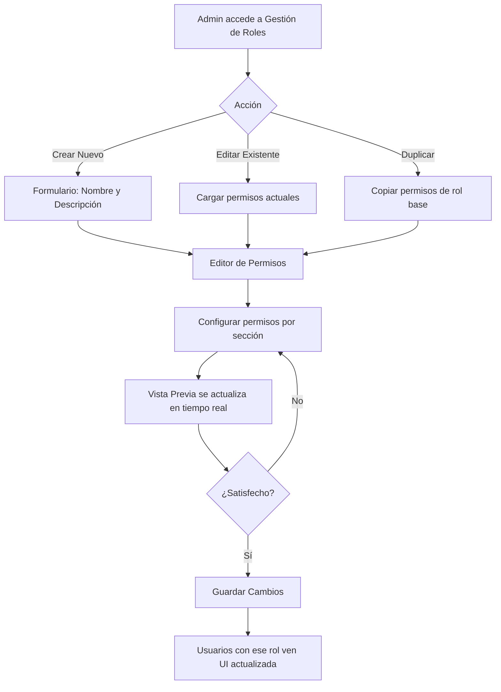
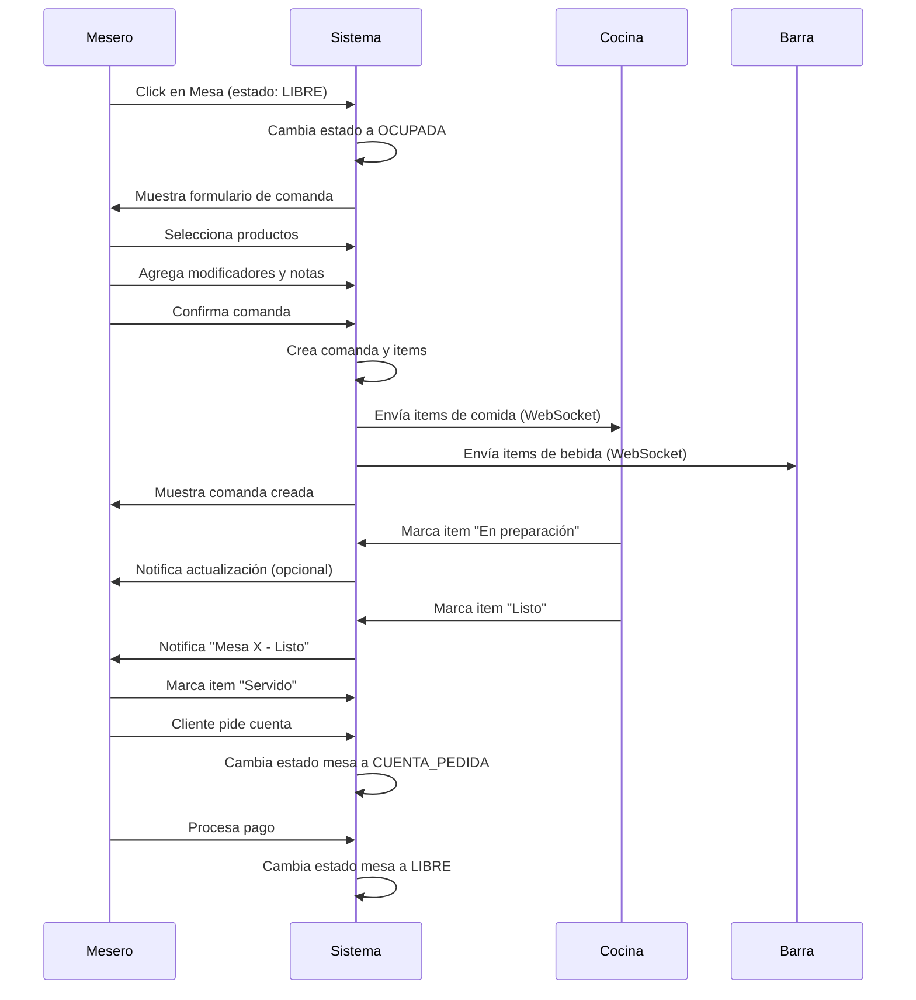
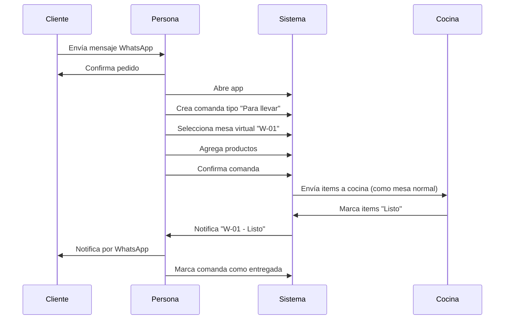
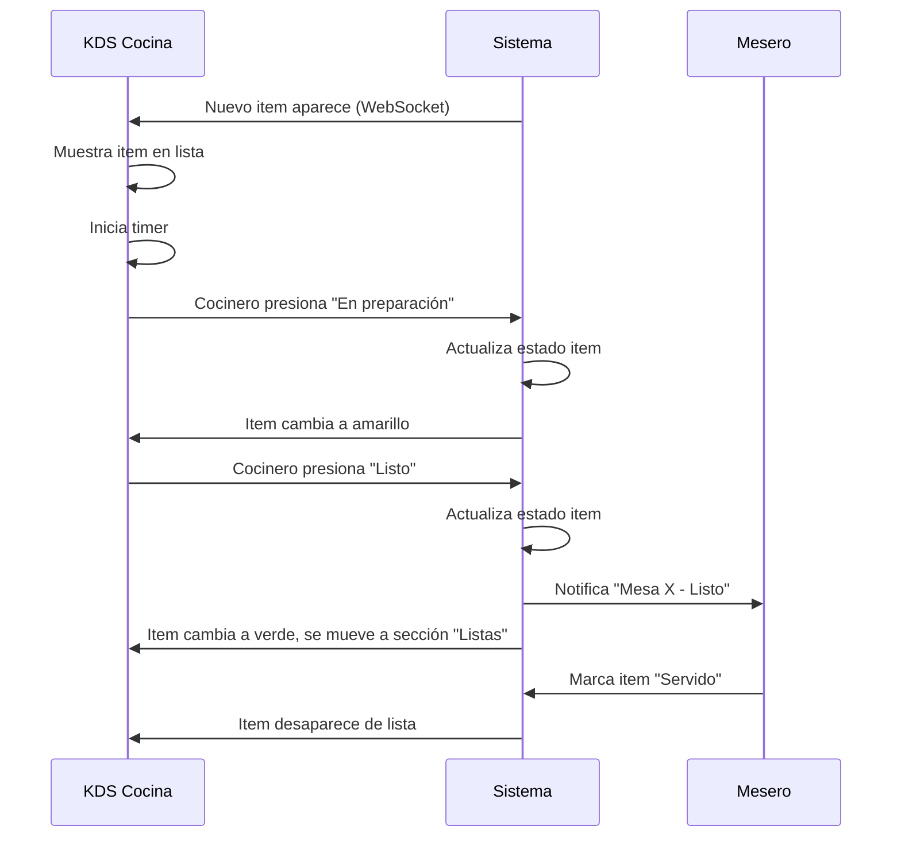
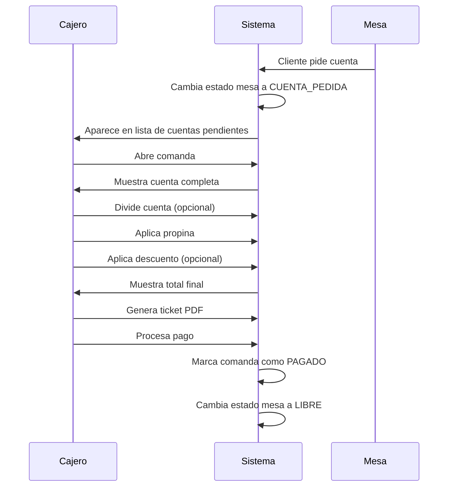
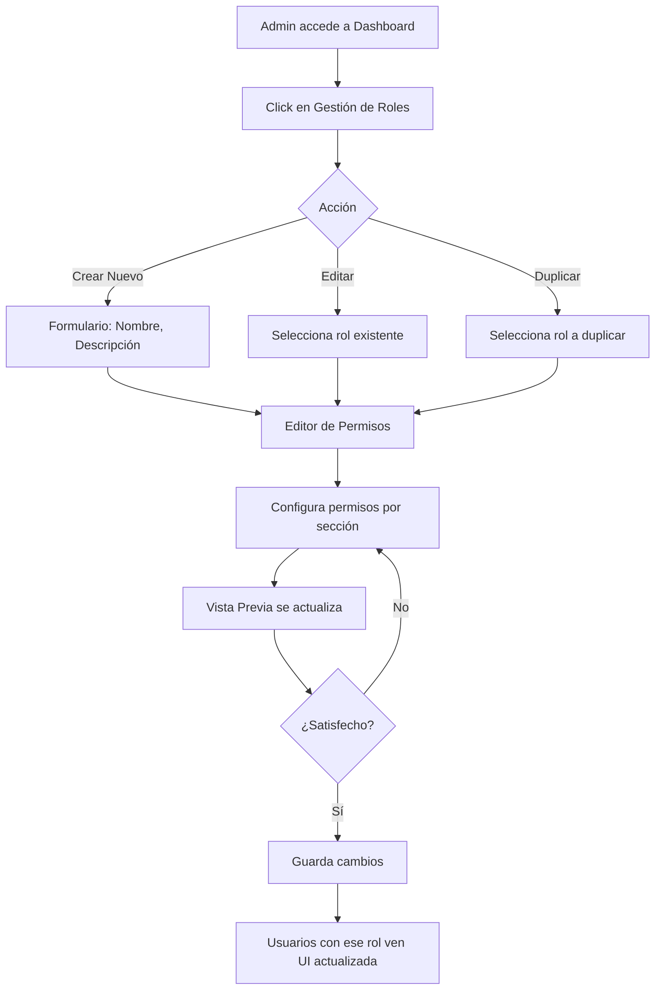
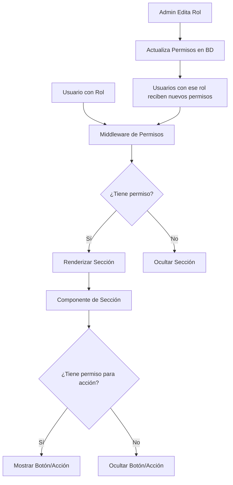

# 🎨 Guía de Diseño UI/UX: Sistema de Comandas para Restaurantes

## 📑 Índice

1. [Filosofía y Principios de Diseño](#1-filosofía-y-principios-de-diseño)
2. [Principios de UX por Rol](#2-principios-de-ux-por-rol)
3. [Sistema de Colores y Estados](#3-sistema-de-colores-y-estados)
4. [Componentes Principales y Especificaciones UI](#4-componentes-principales-y-especificaciones-ui)
5. [Sistema de Gestión de Roles y Permisos](#5-sistema-de-gestión-de-roles-y-permisos)
6. [Patrones de Interacción](#6-patrones-de-interacción)
7. [Guía de Estilo Visual](#7-guía-de-estilo-visual)
8. [Responsive Design](#8-responsive-design)
9. [Accesibilidad](#9-accesibilidad)
10. [Flujos de Usuario Detallados](#10-flujos-de-usuario-detallados)
11. [Arquitectura de Compartimentación](#11-arquitectura-de-compartimentación)
12. [Consideraciones Especiales](#12-consideraciones-especiales)

---

## 1. Filosofía y Principios de Diseño

### 1.1 Filosofía Central: "Sin Chat, Sin Floro"

El sistema está diseñado bajo la premisa de que es una **herramienta de operación, no un juguete de IA**. Esta filosofía se refleja en:

- **Simplicidad Operativa**: Cada pantalla tiene un propósito claro y directo
- **Velocidad**: Acciones comunes deben completarse en máximo 2-3 clicks
- **Claridad Visual**: Información crítica visible de inmediato, sin necesidad de buscar
- **Sin Distracciones**: No hay elementos decorativos innecesarios que ralenticen el trabajo

### 1.2 Principios Fundamentales

#### 1.2.1 Diseñado para Personal No Técnico

- **Iconografía Universal**: Iconos que cualquier persona puede entender sin capacitación
- **Etiquetas Claras**: Textos descriptivos, no términos técnicos
- **Feedback Inmediato**: Confirmaciones visuales de cada acción realizada
- **Errores Prevenibles**: Validaciones que evitan errores antes de que ocurran

#### 1.2.2 Enfoque en Simplicidad y Velocidad

- **Menos Clicks = Mejor UX**: Flujos optimizados para reducir pasos
- **Información Jerárquica**: Lo más importante siempre visible primero
- **Acciones Rápidas**: Botones grandes y accesibles para acciones frecuentes
- **Búsqueda Rápida**: Búsqueda instantánea de productos, mesas, comandas

#### 1.2.3 Eliminación de Fricción

- **Sin Papelitos**: Todo digital, todo en tiempo real
- **Sin Gritos**: Comunicación automática entre cocina, barra y meseros
- **Sin Esperas**: Actualizaciones en tiempo real sin recargar páginas
- **Sin Confusión**: Estados claros y visibles en todo momento

---

## 2. Principios de UX por Rol

### 2.1 MESERO

**Objetivo Principal**: Crear comandas rápidamente y atender mesas eficientemente.

**Principios de Diseño**:
- **Acceso Rápido a Mesas**: Mapa visual de mesas con estados claros
- **Creación de Comanda en 3 Pasos**: Mesa → Productos → Confirmar
- **Búsqueda Instantánea**: Encontrar productos por nombre o categoría rápidamente
- **Vista de Estado**: Ver qué items están listos sin navegar a otras páginas
- **Notificaciones Visuales**: Alertas claras cuando cocina/barra termina un pedido

**Pantallas Clave**:
- Mapa de Mesas (página principal)
- Formulario de Comanda Rápida
- Vista de Comanda Activa
- Panel de Cuenta

### 2.2 CAJERO

**Objetivo Principal**: Procesar pagos rápidamente y manejar cuentas.

**Principios de Diseño**:
- **Lista de Comandas Pendientes**: Ver todas las cuentas pedidas
- **División de Cuenta Intuitiva**: Dividir por persona o por productos fácilmente
- **Cálculo Automático**: Propinas y descuentos calculados automáticamente
- **Generación de Ticket**: Un click para imprimir/generar PDF
- **Historial Rápido**: Acceso rápido a comandas recientes

**Pantallas Clave**:
- Lista de Comandas (filtrada por estado PAGADO)
- Panel de Cuenta Detallado
- Historial de Transacciones

### 2.3 COCINERO / BARTENDER

**Objetivo Principal**: Ver pedidos pendientes y actualizar estados eficientemente.

**Principios de Diseño**:
- **Vista Vertical de Items**: Lista clara de todos los items pendientes
- **Agrupación por Mesa**: Items organizados por mesa para facilitar preparación
- **Tiempo Visible**: Ver cuánto tiempo lleva cada pedido
- **Botones Grandes**: Botones grandes para cambiar estado (En preparación → Listo)
- **Orden por Prioridad**: Items más antiguos aparecen primero
- **Sin Distracciones**: Pantalla enfocada solo en lo que necesita preparar

**Pantallas Clave**:
- KDS Cocina (solo comida)
- KDS Barra (solo bebidas)

### 2.4 ADMIN / GERENTE

**Objetivo Principal**: Acceso completo a todas las funciones con diseño minimalista y funcional.

**Principios de Diseño**:
- **Dashboard Central**: Vista de todas las funciones en un solo lugar
- **Acceso a Todo**: Puede ver y usar todas las secciones (Mesas, Comandas, Cocina, Barra, Reportes, Configuración)
- **Vista de Estado Global**: Ver estado de cocina y barra sin navegar
- **Gestión de Roles**: Crear y personalizar roles con permisos granulares
- **Navegación Rápida**: Todas las funciones a máximo 2 clicks de distancia
- **Diseño Minimalista**: Sin elementos innecesarios, solo lo esencial

**Pantallas Clave**:
- Dashboard Admin (página principal con todas las funciones)
- Gestión de Roles y Permisos
- Reportes y Analytics
- Configuración del Sistema

---

## 3. Sistema de Colores y Estados

### 3.1 Estados de Mesa

Los estados de mesa utilizan un sistema de colores universalmente reconocible:

| Estado | Color | Código Tailwind | Significado |
|--------|-------|-----------------|------------|
| **LIBRE** | Verde | `bg-green-500` | Mesa disponible, sin comanda activa |
| **OCUPADA** | Amarillo | `bg-yellow-500` | Mesa con comanda abierta |
| **CUENTA_PEDIDA** | Rojo | `bg-red-500` | Cliente pidió la cuenta |
| **RESERVADA** | Azul | `bg-blue-500` | Mesa reservada para más tarde |

**Implementación Visual**:
- Cards grandes con color de fondo sólido
- Texto blanco sobre fondo de color para máximo contraste
- Hover state: Color más oscuro (`hover:bg-{color}-600`)
- Transición suave en cambios de estado

### 3.2 Estados de Items de Comanda

| Estado | Color | Icono | Significado |
|--------|-------|-------|------------|
| **PENDIENTE** | Gris | ⏳ | Item esperando ser preparado |
| **EN_PREPARACION** | Amarillo | 🔥 | Item siendo preparado ahora |
| **LISTO** | Verde | ✅ | Item listo para servir |
| **ENTREGADO** | Azul | 📦 | Item ya entregado al mesero |

**Visualización en KDS**:
- Badge de color en la esquina superior derecha del item
- Tiempo transcurrido visible debajo del estado
- Animación sutil cuando cambia de estado

### 3.3 Estados de Comanda General

| Estado | Color | Significado |
|--------|-------|-------------|
| **PENDIENTE** | Gris | Comanda creada, esperando preparación |
| **EN_PREPARACION** | Amarillo | Al menos un item en preparación |
| **LISTO** | Verde | Todos los items listos |
| **SERVIDO** | Azul | Items entregados al mesero |
| **PAGADO** | Verde Oscuro | Comanda pagada y cerrada |
| **CANCELADO** | Rojo | Comanda cancelada |

### 3.4 Indicadores de Estado Crítico

Para alertas y situaciones que requieren atención inmediata:

- **Normal**: Verde (`bg-green-100 text-green-800`)
- **Ocupado**: Amarillo (`bg-yellow-100 text-yellow-800`)
- **Crítico**: Rojo (`bg-red-100 text-red-800`) - Requiere acción inmediata

**Uso en Dashboard Admin**:
- Contador de items pendientes en cocina/barra
- Si > 10 items pendientes → Estado "Ocupado"
- Si > 20 items pendientes → Estado "Crítico"

---

## 4. Componentes Principales y Especificaciones UI

### 4.1 Mapa de Mesas

**Ubicación**: `app/dashboard/mesas/page.tsx`

**Funcionalidad Principal**:
- Visualización de todas las mesas en grid responsive
- Click en mesa → Abre comanda existente o crea nueva
- Actualización en tiempo real del estado de cada mesa

**Especificaciones de Diseño**:

```typescript
// Estructura del Componente MesaCard
interface MesaCardProps {
  numero: number
  estado: EstadoMesa
  capacidad: number
  comandaActual?: {
    numeroComanda: string
    total: number
  } | null
  onClick: () => void
}
```

**Layout Visual**:
- **Grid Responsive**: 
  - Mobile: 2 columnas
  - Tablet: 4 columnas
  - Desktop: 6 columnas
- **Card Dimensions**: 
  - Min height: 120px
  - Padding: 24px (p-6)
  - Border radius: 8px (rounded-lg)
- **Contenido del Card**:
  - Número de mesa grande y visible (text-3xl font-bold)
  - Estado actual (text-sm)
  - Capacidad (text-xs)
  - Número de comanda si existe (badge pequeño)

**Estados Interactivos**:
- **Hover**: Scale 1.05 (hover:scale-105)
- **Active**: Scale 0.95 (active:scale-95)
- **Transition**: Suave (transition-all)

**Actualización en Tiempo Real**:
- Polling cada 10 segundos
- WebSocket para actualizaciones instantáneas cuando cambia estado

### 4.2 Formulario de Comanda Rápida

**Ubicación**: `app/dashboard/comandas/nueva/page.tsx`

**Funcionalidad Principal**:
- Crear comanda nueva en 3 pasos simples
- Búsqueda rápida de productos
- Agregar modificadores y notas
- Vista previa de total antes de confirmar

**Especificaciones de Diseño**:

**Layout de 2 Columnas**:
- **Columna Izquierda (60%)**: Selección de productos
  - Búsqueda de productos (input grande, autofocus)
  - Filtros por categoría (tabs horizontales)
  - Grid de productos (cards con imagen, nombre, precio)
  - Botón "Agregar" en cada producto
- **Columna Derecha (40%)**: Resumen de comanda
  - Lista de items agregados
  - Modificadores por item
  - Campo de notas
  - Total visible y destacado
  - Botón "Confirmar Comanda" grande y prominente

**Búsqueda de Productos**:
- Input de búsqueda siempre visible en la parte superior
- Búsqueda instantánea (sin botón, busca mientras escribes)
- Resultados filtrados en tiempo real
- Highlight de texto coincidente

**Selección de Productos**:
- Cards de producto con:
  - Imagen del producto (si existe)
  - Nombre del producto
  - Precio destacado
  - Botón "Agregar" grande
- Click en card → Agrega producto a comanda

**Modificadores**:
- Panel desplegable por producto
- Checkboxes para modificadores disponibles
- Precio extra visible si aplica
- Botón "Aplicar" para confirmar modificadores

**Vista Previa de Total**:
- Total siempre visible en la parte inferior
- Desglose opcional (subtotal, propina, descuento)
- Botón de confirmación grande y destacado

### 4.3 KDS Cocina (Kitchen Display System)

**Ubicación**: `app/dashboard/cocina/page.tsx`

**Funcionalidad Principal**:
- Mostrar todos los items de comida pendientes
- Agrupados por mesa
- Ordenados por tiempo (más antiguos primero)
- Botones grandes para cambiar estado

**Especificaciones de Diseño**:

**Layout Vertical**:
- Lista vertical de items (scroll infinito si hay muchos)
- Cada item ocupa toda el ancho disponible
- Agrupación visual por mesa (header de mesa con número)

**Card de Item**:
```
┌─────────────────────────────────────────┐
│ MESA 5                    ⏱ 00:05:23    │
├─────────────────────────────────────────┤
│ 2x Alambre                               │
│ Notas: Sin cebolla, bien cocido          │
│                                          │
│ [En Preparación]  [Listo]               │
└─────────────────────────────────────────┘
```

**Elementos del Card**:
- **Header**: Número de mesa + Tiempo transcurrido
- **Cuerpo**: Cantidad x Nombre del producto
- **Notas**: Si hay notas especiales, mostrarlas destacadas
- **Modificadores**: Lista de modificadores aplicados
- **Botones de Acción**: 
  - "En Preparación" (amarillo)
  - "Listo" (verde, grande y prominente)

**Estados Visuales**:
- **PENDIENTE**: Card con borde gris
- **EN_PREPARACION**: Card con fondo amarillo claro, borde amarillo
- **LISTO**: Card con fondo verde claro, borde verde, animación sutil

**Filtros**:
- Tabs en la parte superior: "Todas" | "En Preparación" | "Listas"
- Contador de items en cada tab

**Actualización en Tiempo Real**:
- WebSocket para actualizaciones instantáneas
- Sonido opcional cuando aparece nuevo item (configurable)

### 4.4 KDS Barra

**Ubicación**: `app/dashboard/barra/page.tsx`

**Funcionalidad Principal**:
- Similar a KDS Cocina pero solo para bebidas
- Estados específicos: "Listo" → "Entregado a Mesero"

**Especificaciones de Diseño**:
- Misma estructura que KDS Cocina
- Filtro automático: Solo muestra items con `destino: BARRA`
- Botones específicos:
  - "Listo" (verde)
  - "Entregado" (azul)

### 4.5 Panel de Cuenta

**Ubicación**: `app/dashboard/comandas/[numeroComanda]/page.tsx`

**Funcionalidad Principal**:
- Ver cuenta completa de una comanda
- Dividir cuenta por persona o por productos
- Aplicar propina y descuentos
- Generar ticket PDF
- Marcar como pagado

**Especificaciones de Diseño**:

**Layout de 2 Columnas**:
- **Columna Izquierda**: Detalles de la cuenta
  - Lista de items con precios
  - Subtotal
  - Propina (input editable)
  - Descuento (input editable)
  - Total final (destacado)
- **Columna Derecha**: Opciones de pago
  - Dividir cuenta
  - Métodos de pago
  - Generar ticket
  - Marcar como pagado

**División de Cuenta**:
- Modal o panel lateral para dividir
- Opciones:
  - Dividir por persona (número de personas)
  - Dividir por productos (seleccionar items)
- Vista previa de total por persona/item

**Botones de Acción**:
- "Dividir Cuenta" (secundario)
- "Generar Ticket" (primario)
- "Marcar como Pagado" (destacado, verde)

### 4.6 Dashboard Admin

**Ubicación**: `app/dashboard/page.tsx`

**Funcionalidad Principal**:
- Vista central con acceso a todas las funciones
- Resumen del estado de cocina y barra
- Navegación rápida a cada sección
- 100% de permisos y funciones

**Especificaciones de Diseño**:

**Layout Principal**:

```
┌─────────────────────────────────────────────────────────┐
│  Dashboard Admin                    [Usuario] [Logout]  │
├─────────────────────────────────────────────────────────┤
│                                                          │
│  ┌──────────┐  ┌──────────┐  ┌──────────┐             │
│  │  Mesas   │  │ Comandas │  │  Cocina  │             │
│  │   12     │  │    8     │  │  5 items│             │
│  │ Ocupadas │  │ Activas  │  │ Pendiente│             │
│  └──────────┘  └──────────┘  └──────────┘             │
│                                                          │
│  ┌──────────┐  ┌──────────┐  ┌──────────┐             │
│  │  Barra   │  │ Reportes │  │ Config.  │             │
│  │ 3 items  │  │  Ver más  │  │  Sistema │             │
│  │ Pendiente│  │          │  │          │             │
│  └──────────┘  └──────────┘  └──────────┘             │
│                                                          │
│  ┌──────────────────────────────────────────┐          │
│  │  Gestión de Roles y Permisos             │          │
│  │  Crear, editar y personalizar roles     │          │
│  └──────────────────────────────────────────┘          │
└─────────────────────────────────────────────────────────┘
```

**Grid de Cards**:
- **Tamaño**: Cards grandes (min 200px x 150px)
- **Layout**: Grid responsive
  - Desktop: 3-4 columnas
  - Tablet: 2 columnas
  - Mobile: 1 columna
- **Contenido de cada Card**:
  - Icono grande (Heroicons)
  - Título de la sección
  - Contador/Estado (si aplica)
  - Badge de estado (normal/ocupado/crítico)
  - Botón "Acceder" o click en toda la card

**Cards Especiales**:

1. **Mesas Card**:
   - Contador: "X ocupadas de Y total"
   - Estado: Verde/Amarillo/Rojo según ocupación
   - Click → Va a mapa de mesas

2. **Comandas Card**:
   - Contador: "X comandas activas"
   - Lista rápida de últimas 3 comandas
   - Click → Va a lista de comandas

3. **Cocina Card**:
   - Contador: "X items pendientes"
   - Estado: Normal/Ocupado/Crítico
   - Tiempo promedio de espera
   - Click → Va a KDS Cocina

4. **Barra Card**:
   - Similar a Cocina pero para bebidas
   - Click → Va a KDS Barra

5. **Reportes Card**:
   - Acceso rápido a reportes principales
   - Vista previa de ventas del día
   - Click → Va a sección de reportes

6. **Configuración Card**:
   - Acceso a todas las configuraciones
   - Gestión de productos, categorías, mesas, usuarios
   - Click → Va a panel de configuración

7. **Gestión de Roles Card**:
   - Acceso al editor de roles
   - Contador de roles configurados
   - Click → Va a editor de roles

**Navegación Superior**:
- Sidebar o top navigation siempre visible
- Todas las secciones listadas
- Indicador de página actual
- Búsqueda global (opcional)

**Vista de Resumen en Tiempo Real**:
- Widget de estado de cocina/barra siempre visible
- Actualización automática vía WebSocket
- Alertas visuales cuando hay muchos items pendientes

---

## 5. Sistema de Gestión de Roles y Permisos

### 5.1 Filosofía de Diseño

**Enfoque en 3 Etapas**:

1. **Primero**: Diseñar UI completa del admin con 100% de funciones
2. **Segundo**: Compartimentar secciones para facilitar personalización
3. **Tercero**: Permitir agregar/remover funciones, secciones, botones por rol

### 5.2 Vista de Gestión de Roles

**Ubicación**: `app/dashboard/admin/roles/page.tsx`

**Funcionalidad Principal**:
- Lista de todos los roles existentes
- Crear nuevo rol personalizado
- Editar rol existente
- Duplicar rol como plantilla
- Eliminar rol (con confirmación)

**Especificaciones de Diseño**:

**Layout**:
```
┌─────────────────────────────────────────────────────────┐
│  Gestión de Roles y Permisos      [+ Nuevo Rol]        │
├─────────────────────────────────────────────────────────┤
│                                                          │
│  ┌──────────────────────────────────────────────────┐  │
│  │ ADMIN                                            │  │
│  │ Todos los permisos                               │  │
│  │ 1 usuario asignado                              │  │
│  │ [Editar] [Duplicar] [Eliminar]                  │  │
│  └──────────────────────────────────────────────────┘  │
│                                                          │
│  ┌──────────────────────────────────────────────────┐  │
│  │ MESERO                                           │  │
│  │ Mesas, Comandas                                  │  │
│  │ 3 usuarios asignados                            │  │
│  │ [Editar] [Duplicar] [Eliminar]                  │  │
│  └──────────────────────────────────────────────────┘  │
│                                                          │
│  ... (más roles)                                        │
│                                                          │
└─────────────────────────────────────────────────────────┘
```

**Card de Rol**:
- Nombre del rol (grande y destacado)
- Descripción breve de permisos
- Contador de usuarios asignados
- Botones de acción: Editar, Duplicar, Eliminar
- Badge si es rol predefinido vs personalizado

**Botón "Nuevo Rol"**:
- Grande y prominente en la parte superior
- Modal o nueva página para crear rol
- Formulario simple: Nombre, Descripción, Permisos

### 5.3 Editor de Rol

**Funcionalidad Principal**:
- Configurar permisos por sección
- Vista previa en tiempo real del dashboard para ese rol
- Guardar y aplicar cambios

**Especificaciones de Diseño**:

**Layout de 2 Paneles**:

```
┌─────────────────────────────────────────────────────────┐
│  Editor de Rol: MESERO                    [Guardar] [X] │
├──────────────────────┬──────────────────────────────────┤
│                      │                                    │
│  CONFIGURACIÓN       │  VISTA PREVIA                     │
│  DE PERMISOS         │  (Dashboard como este rol)        │
│                      │                                    │
│  ☑ Mesas             │  ┌──────────────────────────────┐ │
│    ☑ Ver mesas        │  │  Dashboard                   │ │
│    ☑ Crear comanda    │  │                              │ │
│    ☐ Modificar estado │  │  [Mesas] [Comandas]         │ │
│                      │  │                              │ │
│  ☑ Comandas          │  │  (Solo secciones permitidas) │ │
│    ☑ Ver comandas     │  │                              │ │
│    ☑ Crear comanda    │  └──────────────────────────────┘ │
│    ☐ Modificar        │                                    │
│    ☐ Cancelar         │                                    │
│                      │                                    │
│  ☐ Cocina            │                                    │
│    (deshabilitado)    │                                    │
│                      │                                    │
│  ☐ Barra             │                                    │
│    (deshabilitado)    │                                    │
│                      │                                    │
│  ☐ Reportes          │                                    │
│    (deshabilitado)    │                                    │
│                      │                                    │
│  ☐ Configuración     │                                    │
│    (deshabilitado)    │                                    │
│                      │                                    │
└──────────────────────┴──────────────────────────────────┘
```

**Panel de Configuración de Permisos**:

**Estructura de Árbol**:
- Cada sección principal es un checkbox/toggle
- Al activar sección, se muestran sub-opciones
- Sub-opciones también son checkboxes
- Indentación visual para mostrar jerarquía

**Secciones Compartimentadas**:

1. **Mesas**
   - ☑ Ver mesas
   - ☑ Crear comanda desde mesa
   - ☐ Modificar estado de mesa
   - ☐ Ver historial de mesa

2. **Comandas**
   - ☑ Ver comandas
   - ☑ Crear comanda
   - ☐ Modificar comanda
   - ☐ Cancelar comanda
   - ☑ Ver detalles de comanda

3. **Cocina (KDS)**
   - ☐ Ver items pendientes
   - ☐ Actualizar estado de items
   - ☐ Ver tiempos de preparación

4. **Barra (KDS)**
   - ☐ Ver items pendientes
   - ☐ Actualizar estado de items
   - ☐ Ver tiempos de preparación

5. **Reportes**
   - ☐ Ver reportes de ventas
   - ☐ Ver reportes de mesero
   - ☐ Ver reportes de mesa
   - ☐ Exportar reportes

6. **Configuración**
   - ☐ Gestión de productos
   - ☐ Gestión de categorías
   - ☐ Gestión de mesas
   - ☐ Gestión de usuarios
   - ☐ Gestión de roles

**Funcionalidades Avanzadas**:
- **Toggle "Todo"**: Activar/desactivar toda una sección de una vez
- **Plantillas**: Botones para aplicar plantillas predefinidas
- **Permisos Heredables**: Opción de extender un rol base
- **Permisos Personalizados**: Campo para agregar permisos custom (futuro)

**Panel de Vista Previa**:

**Funcionalidad**:
- Muestra el dashboard como se vería para ese rol
- Actualización en tiempo real cuando cambias permisos
- Sidebar dinámico: Solo muestra secciones permitidas
- Botones ocultos: Los botones sin permiso no aparecen
- Indicadores visuales: Mostrar qué está habilitado/deshabilitado

**Implementación Técnica Sugerida**:
- Componente de preview que renderiza el dashboard real
- Props de permisos que filtran qué se muestra
- Modo "preview" que desactiva acciones reales (solo visual)

### 5.4 Comparador de Roles

**Funcionalidad Opcional**:
- Vista lado a lado de dos roles
- Comparar permisos entre roles
- Útil para entender diferencias

**Layout**:
```
┌──────────────────────┬──────────────────────┐
│  Rol: MESERO         │  Rol: CAJERO        │
├──────────────────────┼──────────────────────┤
│  Permisos:           │  Permisos:           │
│  ☑ Mesas            │  ☐ Mesas             │
│  ☑ Comandas         │  ☑ Comandas          │
│  ☐ Reportes         │  ☑ Reportes          │
│  ...                 │  ...                 │
└──────────────────────┴──────────────────────┘
```

### 5.5 Flujo de Uso del Editor de Roles



---

## 6. Patrones de Interacción

### 6.1 Click Único para Acciones Principales

**Principio**: Las acciones más comunes deben completarse con un solo click.

**Ejemplos**:
- Click en mesa → Abre comanda directamente
- Click en "Listo" en KDS → Cambia estado inmediatamente
- Click en "Confirmar" → Crea comanda sin confirmación adicional

**Excepciones**:
- Acciones destructivas (cancelar, eliminar) requieren confirmación
- Acciones que afectan dinero (pagar, aplicar descuento) pueden requerir confirmación

### 6.2 Feedback Inmediato

**Principio**: Cada acción debe tener feedback visual inmediato.

**Implementación**:
- **Toast Notifications**: Mensajes breves que desaparecen automáticamente
  - Éxito: Verde
  - Error: Rojo
  - Info: Azul
  - Advertencia: Amarillo
- **Estados de Botones**: 
  - Loading state mientras procesa
  - Disabled state cuando no aplica
  - Success state brevemente después de acción exitosa
- **Animaciones Sutiles**:
  - Transiciones suaves en cambios de estado
  - Pulse animation en notificaciones importantes
  - Scale animation en clicks

### 6.3 Navegación Intuitiva

**Principio**: El usuario siempre debe saber dónde está y cómo volver.

**Implementación**:
- **Breadcrumbs**: Para páginas anidadas (ej: Dashboard > Comandas > Comanda #123)
- **Sidebar/Navbar**: Siempre visible con indicador de página actual
- **Botón "Atrás"**: En páginas de detalle
- **Título de Página**: Siempre visible indicando contexto

### 6.4 Actualizaciones en Tiempo Real

**Principio**: Los datos deben actualizarse automáticamente sin recargar.

**Implementación**:
- **WebSocket**: Para actualizaciones instantáneas
- **Polling**: Como fallback cada 10-30 segundos
- **Indicadores Visuales**:
  - Badge de "nuevo" en items nuevos
  - Animación sutil cuando aparece nuevo contenido
  - Contador que se actualiza automáticamente

---

## 7. Guía de Estilo Visual

### 7.1 Tipografía

**Fuentes**:
- **Sistema Font Stack**: Usar fuentes del sistema para mejor rendimiento
  ```css
  font-family: -apple-system, BlinkMacSystemFont, 'Segoe UI', Roboto, 'Helvetica Neue', Arial, sans-serif;
  ```

**Tamaños**:
- **Títulos Principales**: `text-3xl` (30px) - `font-bold`
- **Títulos de Sección**: `text-2xl` (24px) - `font-semibold`
- **Subtítulos**: `text-xl` (20px) - `font-medium`
- **Texto Normal**: `text-base` (16px) - `font-normal`
- **Texto Pequeño**: `text-sm` (14px) - `font-normal`
- **Texto Muy Pequeño**: `text-xs` (12px) - `font-normal`

**Jerarquía Visual**:
- Títulos siempre más grandes y bold
- Texto importante con `font-semibold`
- Texto secundario con color gris (`text-gray-600`)

### 7.2 Espaciado

**Principio**: Espaciado generoso para uso táctil y claridad visual.

**Sistema de Espaciado** (Tailwind):
- **Padding de Cards**: `p-6` (24px) mínimo
- **Gap entre Cards**: `gap-4` (16px) o `gap-6` (24px)
- **Padding de Botones**: `px-4 py-2` mínimo, `px-6 py-3` para botones importantes
- **Margin entre Secciones**: `mb-6` o `mb-8`

**Regla de Pulgar**:
- Mínimo 44px x 44px para áreas táctiles (iOS/Android guidelines)
- Espaciado vertical generoso para facilitar lectura

### 7.3 Iconografía

**Biblioteca**: Heroicons (v2.0.18)

**Uso**:
- **Tamaño Estándar**: `w-5 h-5` (20px) para iconos inline
- **Tamaño Grande**: `w-6 h-6` (24px) para iconos destacados
- **Tamaño Extra Grande**: `w-8 h-8` (32px) para iconos principales

**Iconos por Contexto**:
- **Mesas**: `TableCellsIcon`
- **Comandas**: `DocumentTextIcon`
- **Cocina**: `FireIcon` o `BeakerIcon`
- **Barra**: `GlassIcon` o `BeakerIcon`
- **Reportes**: `ChartBarIcon`
- **Configuración**: `Cog6ToothIcon`
- **Usuarios**: `UsersIcon`
- **Roles**: `ShieldCheckIcon`

### 7.4 Componentes con Tailwind CSS

**Filosofía**: Utility-first, componentes reutilizables.

**Botones**:

```typescript
// Botón Primario
className="bg-blue-600 hover:bg-blue-700 text-white font-semibold py-2 px-4 rounded-lg transition-colors"

// Botón Secundario
className="bg-gray-200 hover:bg-gray-300 text-gray-800 font-semibold py-2 px-4 rounded-lg transition-colors"

// Botón Destacado (éxito)
className="bg-green-600 hover:bg-green-700 text-white font-semibold py-2 px-4 rounded-lg transition-colors"

// Botón Peligro
className="bg-red-600 hover:bg-red-700 text-white font-semibold py-2 px-4 rounded-lg transition-colors"
```

**Cards**:

```typescript
className="bg-white rounded-lg shadow-md p-6 hover:shadow-lg transition-shadow"
```

**Inputs**:

```typescript
className="w-full px-4 py-2 border border-gray-300 rounded-lg focus:ring-2 focus:ring-blue-500 focus:border-blue-500"
```

### 7.5 Colores del Sistema

**Paleta Principal**:
- **Azul Primario**: `blue-600` (#2563EB) - Acciones principales
- **Verde Éxito**: `green-600` (#16A34A) - Estados positivos
- **Rojo Peligro**: `red-600` (#DC2626) - Errores, alertas
- **Amarillo Advertencia**: `yellow-500` (#EAB308) - Estados de espera
- **Gris Neutro**: `gray-600` (#4B5563) - Texto secundario

**Fondos**:
- **Fondo Principal**: `bg-gray-50` (#F9FAFB)
- **Fondo de Cards**: `bg-white` (#FFFFFF)
- **Fondo de Inputs**: `bg-white` con borde `border-gray-300`

---

## 8. Responsive Design

### 8.1 Breakpoints (Tailwind Default)

- **Mobile**: < 640px
- **Tablet**: 640px - 1024px
- **Desktop**: > 1024px
- **Large Desktop**: > 1280px

### 8.2 Estrategias por Dispositivo

#### 8.2.1 Mobile (< 640px)

**Optimizaciones**:
- **Navegación**: Menú hamburguesa en lugar de sidebar
- **Grid de Mesas**: 2 columnas máximo
- **Formularios**: Una columna, inputs apilados
- **Botones**: Tamaño completo del ancho (`w-full`)
- **KDS**: Cards más compactos pero legibles

**Consideraciones**:
- Áreas táctiles grandes (mínimo 44px)
- Texto legible sin zoom
- Scroll vertical para contenido largo

#### 8.2.2 Tablet (640px - 1024px)

**Optimizaciones**:
- **Grid de Mesas**: 4 columnas
- **Formularios**: 2 columnas cuando sea posible
- **KDS**: Cards medianos, 2 columnas de items
- **Dashboard Admin**: 2-3 columnas de cards

**Uso Típico**:
- Meseros usando tablets para tomar pedidos
- Pantallas táctiles en cocina/barra

#### 8.2.3 Desktop (> 1024px)

**Optimizaciones**:
- **Grid de Mesas**: 6 columnas
- **Formularios**: Layout de 2 columnas completo
- **KDS**: Cards grandes, fácil de ver desde distancia
- **Dashboard Admin**: 3-4 columnas de cards
- **Sidebar**: Siempre visible

**Uso Típico**:
- Administradores en oficina
- Pantallas grandes en cocina/barra (KDS)
- Cajeros en punto de venta

### 8.3 Admin Dashboard Específico

**Optimizado para Desktop**:
- Vista completa de todas las funciones en un solo lugar
- Grid de 3-4 columnas de cards
- Sidebar siempre visible con todas las opciones
- No se oculta funcionalidad en mobile, pero se adapta el layout

---

## 9. Accesibilidad

### 9.1 Contraste

**Estándares WCAG AA**:
- **Texto Normal**: Contraste mínimo 4.5:1
- **Texto Grande**: Contraste mínimo 3:1
- **Componentes UI**: Contraste mínimo 3:1

**Verificación**:
- Usar herramientas como WebAIM Contrast Checker
- Probar con diferentes temas (claro/oscuro si aplica)

### 9.2 Tamaños de Fuente

**Mínimos**:
- **Texto Normal**: 16px (1rem) mínimo
- **Texto Pequeño**: 14px (0.875rem) mínimo, evitar si es posible
- **Títulos**: Proporcionalmente más grandes

**Legibilidad**:
- Line-height generoso: 1.5 mínimo
- Espaciado entre párrafos

### 9.3 Navegación por Teclado

**Requisitos**:
- **Tab Order**: Lógico y predecible
- **Focus Visible**: Indicador claro de elemento enfocado
- **Atajos de Teclado**: 
  - `Enter` para confirmar acciones
  - `Esc` para cerrar modales
  - `Tab` para navegar entre campos

**Implementación**:
```typescript
// Focus ring visible
className="focus:outline-none focus:ring-2 focus:ring-blue-500 focus:ring-offset-2"
```

### 9.4 Feedback Visual y Sonoro

**Visual**:
- Estados claros (hover, active, disabled)
- Animaciones sutiles para feedback
- Colores consistentes para estados

**Sonoro (Opcional)**:
- Sonido opcional cuando aparece nuevo pedido en KDS
- Configurable en preferencias
- No debe ser molesto o intrusivo

### 9.5 Etiquetas y ARIA

**Requisitos**:
- Labels en todos los inputs
- ARIA labels para iconos sin texto
- Roles ARIA apropiados para componentes complejos

**Ejemplo**:
```typescript
<button aria-label="Marcar como listo">
  <CheckIcon className="w-5 h-5" />
</button>
```

---

## 10. Flujos de Usuario Detallados

### 10.1 Flujo: Pedido en Mesa



**Pantallas en el Flujo**:
1. Mapa de Mesas → Click en mesa
2. Formulario de Comanda → Agregar productos → Confirmar
3. Vista de Comanda → Ver estado de items
4. Panel de Cuenta → Dividir → Pagar

### 10.2 Flujo: Pedido por WhatsApp



**Diferencias Clave**:
- Tipo de pedido: "PARA_LLEVAR" o "A_DOMICILIO"
- Mesa virtual: "W-01", "W-02", etc.
- Cliente asociado con datos de contacto

### 10.3 Flujo: KDS Cocina/Barra



**Pantallas en el Flujo**:
1. KDS muestra lista de items pendientes
2. Cocinero ve item, presiona "En preparación"
3. Item cambia de estado visualmente
4. Cocinero termina, presiona "Listo"
5. Item se mueve a sección "Listas"
6. Mesero es notificado

### 10.4 Flujo: Procesamiento de Pago



### 10.5 Flujo: Gestión de Roles (Admin)



**Pantallas en el Flujo**:
1. Dashboard Admin → Click "Gestión de Roles"
2. Lista de Roles → Seleccionar o crear
3. Editor de Permisos → Configurar secciones
4. Vista Previa → Ver cómo se ve
5. Guardar → Aplicar cambios

---

## 11. Arquitectura de Compartimentación

### 11.1 Principio de Diseño

**Modularidad**: Cada sección es un módulo independiente que puede activarse/desactivarse.

**Granularidad**: Permisos a nivel de sección, acción y botón.

**Flexibilidad**: Roles pueden tener combinaciones únicas de permisos.

**Escalabilidad**: Fácil agregar nuevas secciones en el futuro.

### 11.2 Estructura de Secciones Compartimentadas

```
Secciones Principales:
├── Mesas
│   ├── Ver mesas (mesas.ver)
│   ├── Crear comanda (mesas.crear_comanda)
│   ├── Modificar estado mesa (mesas.modificar_estado)
│   └── Ver historial (mesas.ver_historial)
│
├── Comandas
│   ├── Ver comandas (comandas.ver)
│   ├── Crear comanda (comandas.crear)
│   ├── Modificar comanda (comandas.modificar)
│   ├── Cancelar comanda (comandas.cancelar)
│   └── Ver detalles (comandas.ver_detalles)
│
├── Cocina (KDS)
│   ├── Ver items pendientes (cocina.ver)
│   ├── Actualizar estado item (cocina.actualizar_estado)
│   └── Ver tiempos (cocina.ver_tiempos)
│
├── Barra (KDS)
│   ├── Ver items pendientes (barra.ver)
│   ├── Actualizar estado item (barra.actualizar_estado)
│   └── Ver tiempos (barra.ver_tiempos)
│
├── Reportes
│   ├── Ver reportes de ventas (reportes.ventas)
│   ├── Ver reportes de mesero (reportes.mesero)
│   ├── Ver reportes de mesa (reportes.mesa)
│   └── Exportar reportes (reportes.exportar)
│
└── Configuración
    ├── Gestión de productos (config.productos)
    ├── Gestión de categorías (config.categorias)
    ├── Gestión de mesas (config.mesas)
    ├── Gestión de usuarios (config.usuarios)
    └── Gestión de roles (config.roles)
```

### 11.3 Implementación Técnica Sugerida

**Estructura de Permisos**:

```typescript
interface Permiso {
  seccion: string
  accion: string
  habilitado: boolean
}

interface Rol {
  id: string
  nombre: string
  permisos: Permiso[]
}

// Ejemplo de permiso
const permiso: Permiso = {
  seccion: 'comandas',
  accion: 'crear',
  habilitado: true
}
```

**Middleware de Verificación**:

```typescript
function tienePermiso(usuario: Usuario, seccion: string, accion: string): boolean {
  const rol = usuario.rol
  const permisos = obtenerPermisos(rol)
  
  return permisos.some(
    p => p.seccion === seccion && 
         p.accion === accion && 
         p.habilitado === true
  )
}
```

**Componentes Condicionales**:

```typescript
function SeccionComandas({ usuario }: { usuario: Usuario }) {
  const puedeVer = tienePermiso(usuario, 'comandas', 'ver')
  const puedeCrear = tienePermiso(usuario, 'comandas', 'crear')
  
  if (!puedeVer) return null
  
  return (
    <div>
      <h2>Comandas</h2>
      {puedeCrear && <button>Crear Comanda</button>}
      {/* ... más contenido */}
    </div>
  )
}
```

**Layout Dinámico**:

```typescript
function DashboardLayout({ usuario }: { usuario: Usuario }) {
  const seccionesPermitidas = obtenerSeccionesPermitidas(usuario)
  
  return (
    <div>
      <Sidebar>
        {seccionesPermitidas.map(seccion => (
          <NavItem key={seccion.id} href={seccion.href}>
            {seccion.label}
          </NavItem>
        ))}
      </Sidebar>
      <Main>
        {/* Contenido basado en permisos */}
      </Main>
    </div>
  )
}
```

### 11.4 Diagrama de Arquitectura



---

## 12. Consideraciones Especiales

### 12.1 Uso en Ambiente Ruidoso

**Problema**: Restaurantes pueden ser ruidosos, difícil escuchar notificaciones sonoras.

**Soluciones**:
- **Notificaciones Visuales Prominentes**: 
  - Badges grandes y coloridos
  - Animaciones que llamen la atención
  - Contadores que parpadean cuando hay cambios
- **Pantallas Grandes**: KDS en pantallas grandes visibles desde distancia
- **Colores de Alta Visibilidad**: Usar colores contrastantes
- **Sonido Opcional**: Configurable, no forzado

### 12.2 Pantallas Táctiles

**Consideraciones**:
- **Áreas Táctiles Grandes**: Mínimo 44px x 44px (iOS/Android guidelines)
- **Espaciado Adecuado**: Evitar botones muy juntos que causen clicks accidentales
- **Feedback Háptico**: Si el dispositivo lo soporta, vibración sutil en acciones importantes
- **Gestos Simples**: Swipe para acciones secundarias, no críticas

### 12.3 Múltiples Usuarios Simultáneos

**Problema**: Varios meseros, cocineros, etc. usando el sistema al mismo tiempo.

**Soluciones**:
- **Actualizaciones en Tiempo Real**: WebSocket para sincronización instantánea
- **Optimistic Updates**: Actualizar UI inmediatamente, luego confirmar con servidor
- **Conflict Resolution**: Si dos usuarios modifican lo mismo, mostrar alerta y permitir elegir
- **Auditoría**: Registrar quién hizo qué cambio y cuándo

### 12.4 Actualizaciones en Tiempo Real sin Recargar

**Implementación**:
- **WebSocket**: Conexión persistente para actualizaciones instantáneas
- **Polling como Fallback**: Si WebSocket falla, polling cada 10-30 segundos
- **Indicador de Conexión**: Mostrar si está conectado o desconectado
- **Reconexión Automática**: Intentar reconectar si se pierde conexión

### 12.5 Rendimiento

**Optimizaciones**:
- **Lazy Loading**: Cargar componentes solo cuando se necesitan
- **Virtual Scrolling**: Para listas largas (ej: muchas comandas)
- **Debouncing**: En búsquedas, esperar a que usuario termine de escribir
- **Caching**: Cachear datos que no cambian frecuentemente (productos, categorías)

### 12.6 Escalabilidad

**Consideraciones Futuras**:
- **Multi-restaurante**: Si en el futuro se necesita soportar múltiples restaurantes
- **Multi-idioma**: Preparar estructura para internacionalización
- **Temas Personalizables**: Permitir a cada restaurante personalizar colores/branding
- **Plugins/Extensiones**: Arquitectura que permita agregar funcionalidades custom

---

## Checklist de Diseño por Pantalla

### Mapa de Mesas
- [ ] Grid responsive (2/4/6 columnas según dispositivo)
- [ ] Cards con colores según estado
- [ ] Hover y active states claros
- [ ] Actualización en tiempo real
- [ ] Click en mesa navega correctamente

### Formulario de Comanda
- [ ] Búsqueda instantánea de productos
- [ ] Filtros por categoría funcionan
- [ ] Agregar productos es fácil
- [ ] Modificadores visibles y editables
- [ ] Total siempre visible
- [ ] Confirmación clara

### KDS Cocina/Barra
- [ ] Items agrupados por mesa
- [ ] Ordenados por tiempo (más antiguos primero)
- [ ] Botones grandes y accesibles
- [ ] Estados visuales claros
- [ ] Tiempo transcurrido visible
- [ ] Actualización en tiempo real

### Dashboard Admin
- [ ] Todas las funciones accesibles
- [ ] Cards con información relevante
- [ ] Navegación clara
- [ ] Vista de estado de cocina/barra
- [ ] Diseño minimalista pero completo

### Gestión de Roles
- [ ] Lista de roles clara
- [ ] Editor de permisos intuitivo
- [ ] Vista previa en tiempo real
- [ ] Guardar y aplicar funciona correctamente
- [ ] Usuarios ven cambios inmediatamente

---

## Conclusión

Esta guía de diseño UI/UX establece los principios fundamentales para crear una experiencia de usuario excepcional en el sistema de comandas. El enfoque en simplicidad, velocidad y claridad visual asegura que el sistema sea fácil de usar por personal no técnico, mientras que la arquitectura de compartimentación permite flexibilidad total en la personalización de roles.

**Puntos Clave a Recordar**:
1. **Simplicidad sobre Complejidad**: Menos clicks, más claridad
2. **Feedback Inmediato**: El usuario siempre debe saber qué está pasando
3. **Diseño para el Contexto**: Restaurantes son ambientes rápidos y ruidosos
4. **Flexibilidad**: El sistema debe adaptarse a diferentes necesidades de roles
5. **Escalabilidad**: Preparado para crecer sin perder simplicidad

---

**Versión del Documento**: 1.0  
**Última Actualización**: 2024  
**Basado en**: `DOCUMENTACION_TECNICA_APP_COMANDAS.md`
